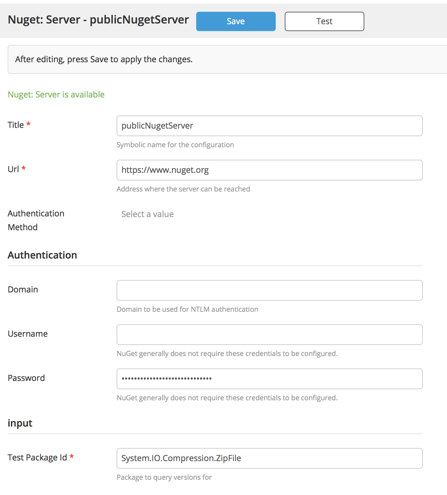
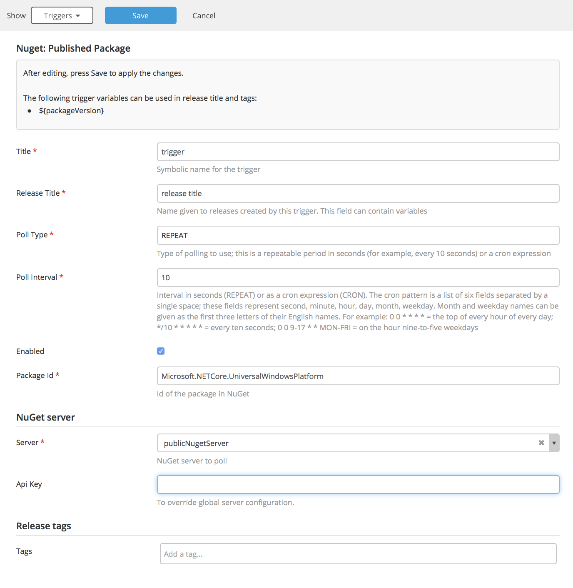

# Preface #

This document describes the functionality provided by the xlr-nuget-trigger-plugin.

See the **[XL Release Documentation](https://docs.xebialabs.com/xl-release/index.html)** for background information on XL Release and release concepts.

# CI status #

[![Build Status][xlr-nuget-trigger-plugin-travis-image] ][xlr-nuget-trigger-plugin-travis-url]
[![Codacy][xlr-nuget-trigger-plugin-codacy-image] ][xlr-nuget-trigger-plugin-codacy-url]
[![License: MIT][xlr-nuget-trigger-plugin-license-image] ][xlr-nuget-trigger-plugin-license-url]
[![Github All Releases][xlr-nuget-trigger-plugin-downloads-image] ]()

[xlr-nuget-trigger-plugin-travis-image]: https://travis-ci.org/xebialabs-community/xlr-nuget-trigger-plugin.svg?branch=master
[xlr-nuget-trigger-plugin-travis-url]: https://travis-ci.org/xebialabs-community/xlr-nuget-trigger-plugin
[xlr-nuget-trigger-plugin-codacy-image]: https://api.codacy.com/project/badge/Grade/b78313b1eb1b4b058dc4512b4d48c26f
[xlr-nuget-trigger-plugin-codacy-url]: https://www.codacy.com/app/rvanstone/xlr-nuget-trigger-plugin
[xlr-nuget-trigger-plugin-license-image]: https://img.shields.io/badge/License-MIT-yellow.svg
[xlr-nuget-trigger-plugin-license-url]: https://opensource.org/licenses/MIT
[xlr-nuget-trigger-plugin-downloads-image]: https://img.shields.io/github/downloads/xebialabs-community/xlr-nuget-trigger-plugin/total.svg

# Overview #

This plugin is a XL Release plugin that enables triggering new releases based on a new NuGet package version showing up in your NuGet server.

## Requirements

- This plugin requires XLR 6.0.x+
- This plugins uses the NuGet v2 API and has no support for v1 or v3

## Installation ##

Place the latest released version under the `plugins` subdirectory in the XL Release installation directory.

## Usage ##

### Setup a NuGet server ###

- Go to Settings > Shared configuration and click `Add Server` under Nuget: Server
- Enter the URL in the URL field, for example `https://www.nuget.org` for the public NuGet server.
- You can enter your API Key if it's required for your organization. Generally, read only access doesn't require an API Key.
- Username/password is very uncommon, but your organization might have implemented it.
- You can enter a 'test package' to search for and click `Test`. You will get feedback if XL Release could retrieve the latest version for that package.
- Don't forget to click `Save` before you leave.

### Add NuGet trigger to a template ###

See [here](https://docs.xebialabs.com/xl-release/how-to/create-a-release-trigger.html) for the generic trigger documentation. This plugin allows you to specify the Package ID as input and it provides the variable `packageVersion` for the triggered release.

## Testing ##

### Start containers for testing ###

Once you have all prerequisies, run `./gradlew runDockerCompose` to spin up an XL Release conainer with this plugin (+ test data loaded).

### Finish XL Release test setup ###

Now open up XL Release (see docker-compose.yml which port, but at time of writing localhost:15516) go into Design > Templates, find the `registry-triggered-template` and click on it, navigate to Triggers in the white dropdown (renders default with 'Release Flow').

For NuGet Server docs and commands, see [here](https://docs.microsoft.com/en-us/nuget/api/search-query-service-resource)
